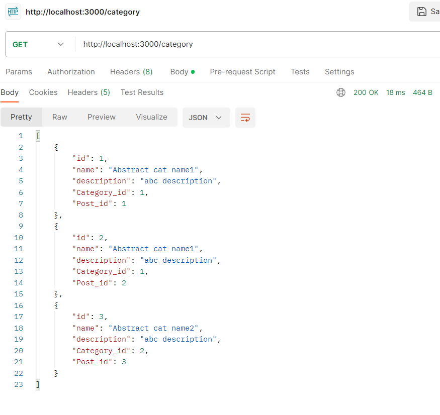
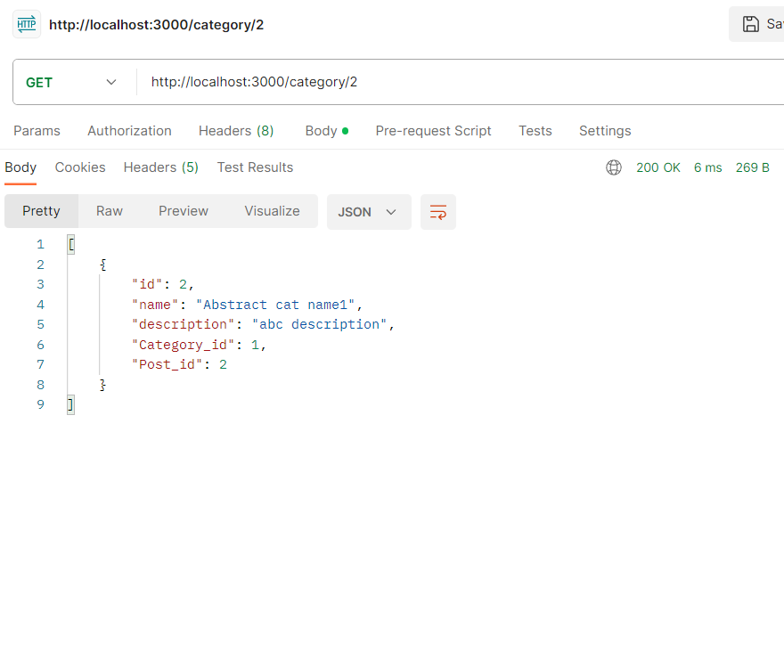
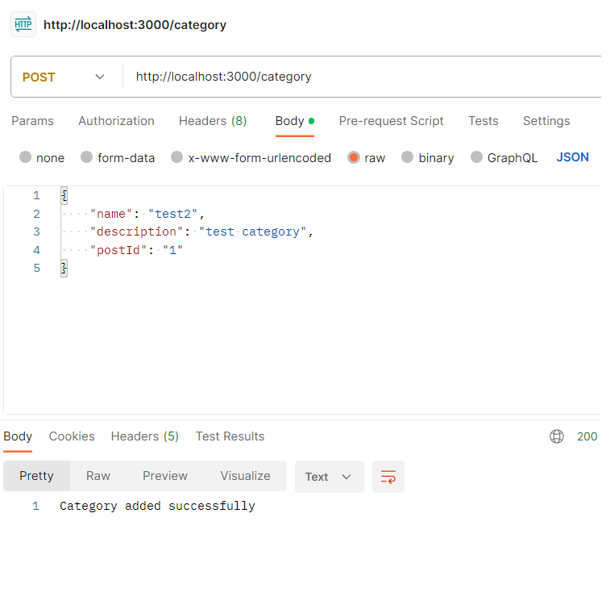
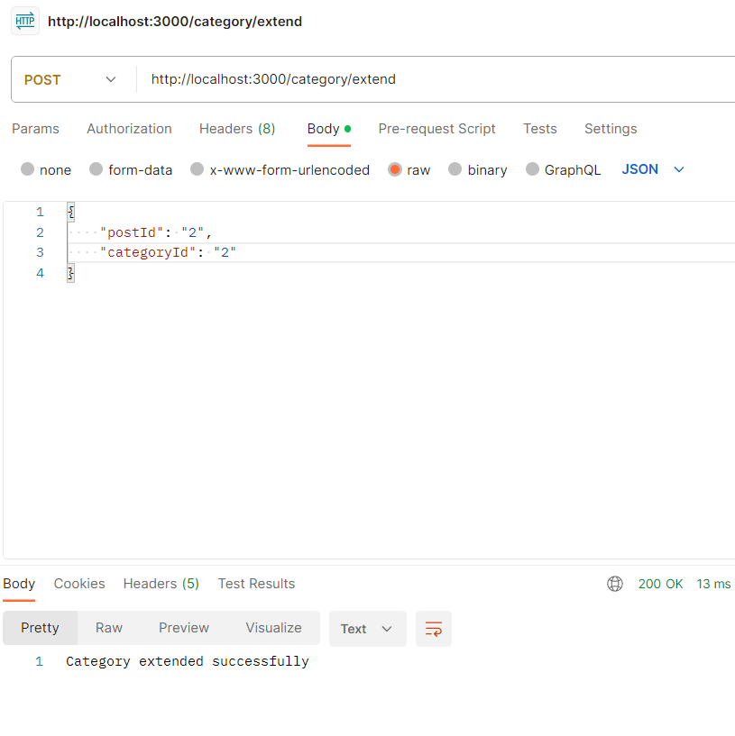
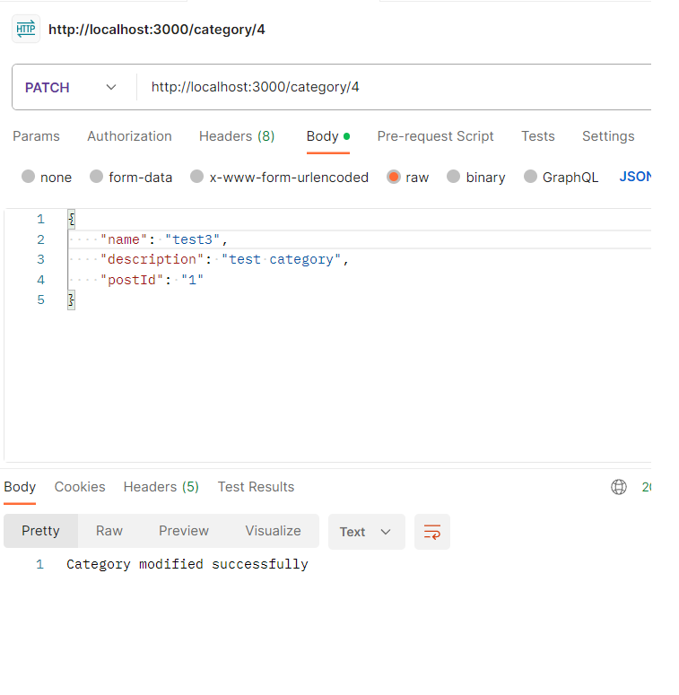
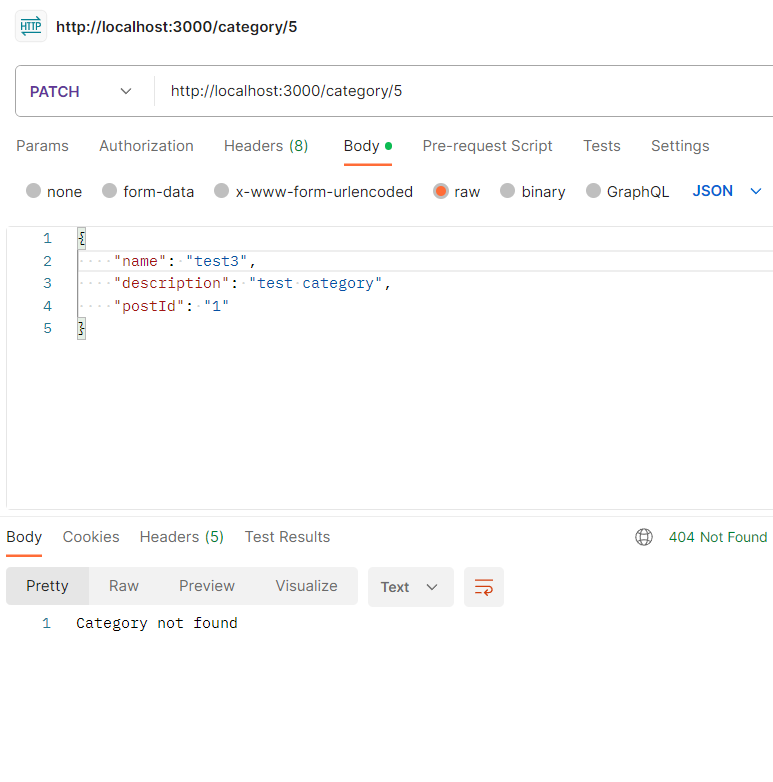
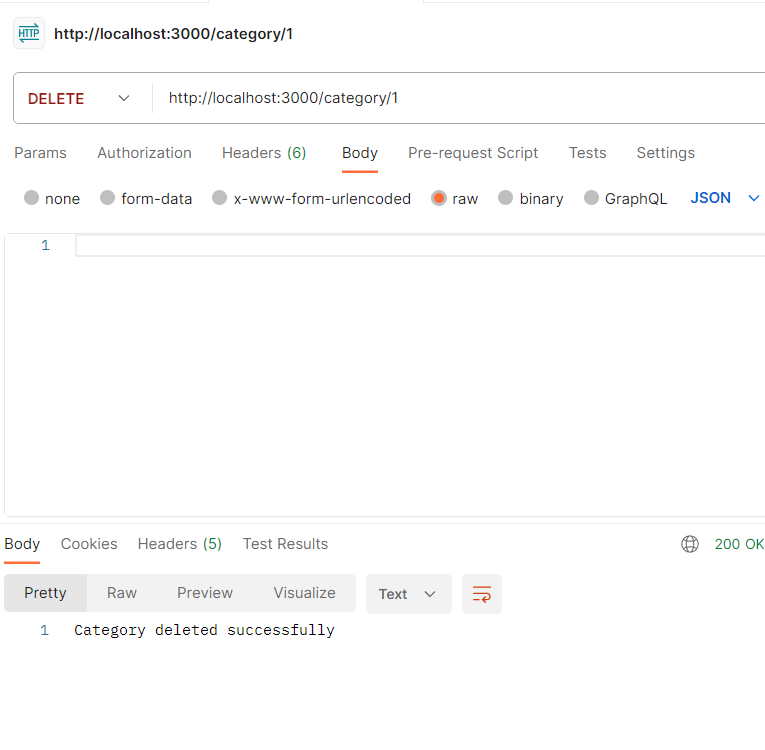
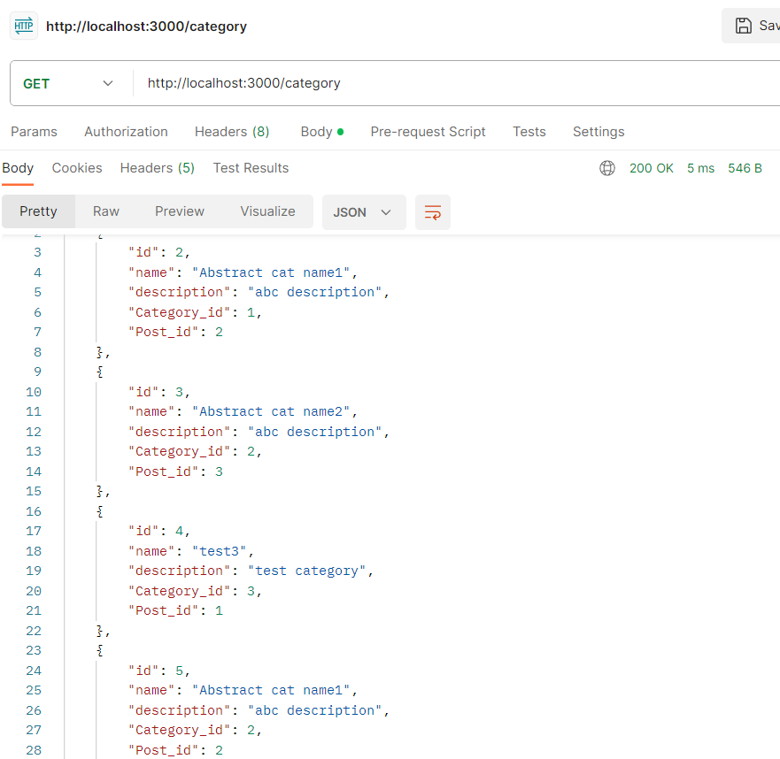

# Тестування працездатності системи

## Засоби тестування
Запускаєте апі, виконуєте декілька запитів, дивитесь кінцевий стан таблиці

## Коди
- 200 — все пройшло нормально (коду 201 не передбачено, якщо запит створює, то він створює, якщо ні — то ні)
- 400 — поганий запит. На даний момент єдина причина цього— запит не пройшов валідацію.
- 404 — шлях або категорію (якщо з нею треба виконати якісь дії) не знайдено.
- 500 — помилка сервера. може бути майже будь-що тому подивіться що конкретно сталось у полі message

## Фото тестування
Прошу вибачення за світлу тему.

+ Тут ми get запитом отримуємо всі записи таблиці

+ Те ж саме, але вже з вказанням в шляху конкретного id дає нам лише окрему таблицю

+ Створюємо нову категорію

+ Створюємо новий запис в таблиці для вже існуючої категорії. Фактично, прикріплюємо вже наявну категорію до певного поста.

+ Змінюємо існуючу категорію.

+ Пробуємо змінити категорію, але такого id не існує в таблиці, тому така відповідь.

+ Видаляємо категорію

+ Тепер дивимось чи вийшло все. Схоже не успіх.

